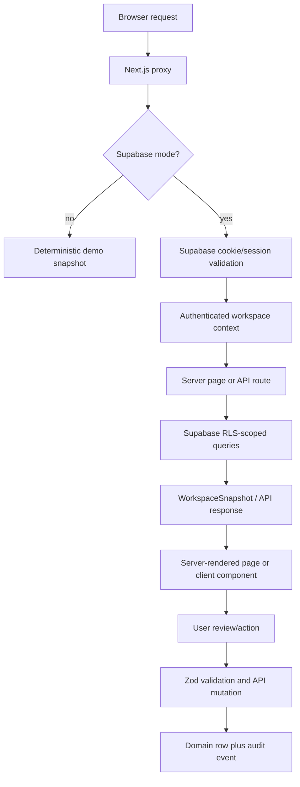
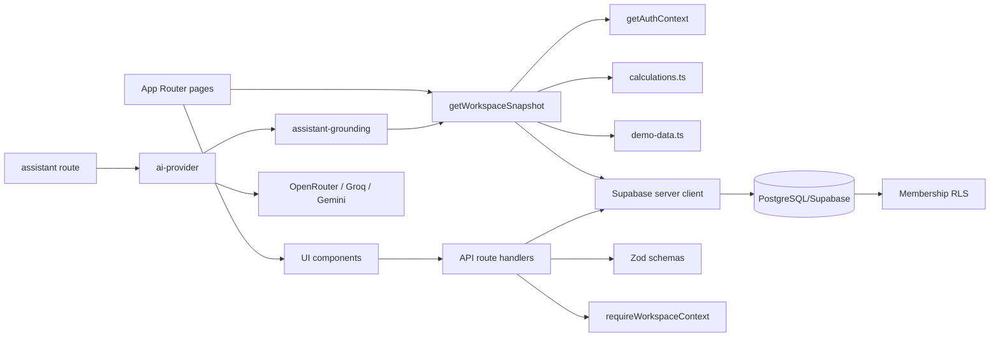

# Trancense — Technical Documentation

This document describes the repository as it exists on 17 July 2026. It is based on the checked-in source, configuration, migrations, scripts, and tests. Statements about behavior are limited to behavior visible in those files. Where the repository does not provide information, this document says **Not present in the repository.**

Generated directories and dependencies are intentionally not described file by file: `node_modules/`, `.next/`, `tsconfig.tsbuildinfo`, and `supabase/.temp/` are generated or installed artifacts, not application source. `public/` contains only `.gitkeep`; application image, font, model, and localization assets are **Not present in the repository.**

## 1. Project Overview

Trancense is an evidence-led energy-audit and engineering decision-support web application for Indian facilities. The product presents utility consumption, production context, asset registers, energy-conservation measures (ECMs), solar scenarios, audit readiness, evidence provenance, reporting, and a grounded assistant.

The repository supports two runtime modes:

| Mode | Source of data | Authentication | Intended use |
|---|---|---|---|
| `demo` | Deterministic values in `lib/demo-data.ts` | Bypassed | Explicit local development/demo only |
| `supabase` | Tenant-scoped Supabase records | Supabase Auth | Persistent user-owned workspaces and production |

Production forcibly resolves to Supabase mode even if `DATA_MODE=demo` is set. The root page redirects users according to mode, authentication, profile completion, and organization membership. The demo root opens `/overview`; an unauthenticated Supabase user goes to `/login`; an authenticated user without an onboarded workspace goes to `/onboarding`; a complete user goes to `/overview`.

The core workflow is:



The product emphasizes traceability rather than autonomous engineering judgment. Domain values carry source IDs, units, evidence status, confidence, assumptions, and formula version. The assistant is instructed to refuse fabrication, unauthorized tenant access, statutory/legal/certification claims, automatic controls, and guaranteed savings.

## 2. Technology Stack

| Technology/package | Purpose | Repository usage |
|---|---|---|
| Next.js `^16.2.10` | Full-stack React framework and App Router | `app/`, route handlers, server components, standalone build |
| React `^19.2.1` / React DOM | UI rendering and client interactions | Pages and `components/` |
| TypeScript `^5.8.2` | Strict static typing | All `.ts` and `.tsx` source |
| Supabase JS `^2.110.7` | Database/Auth client and service-role operations | `lib/supabase*`, API routes, scripts |
| `@supabase/ssr` `^0.12.3` | Browser/server cookie-aware Supabase clients | Browser client, server client, callback, proxy |
| PostgreSQL | Persistence, constraints, triggers, RLS | `supabase/migrations/*.sql` |
| Zod `^4.1.0` | Runtime request validation | API routes and auth-related boundaries |
| Vitest `^3.0.8` | Unit tests | `lib/*.test.ts`, `vitest.config.ts` |
| ESLint / `eslint-config-next` | Linting and Next.js rules | `eslint.config.mjs` |
| `tsx` | Execute TypeScript operational scripts | `db:seed`, `db:remove-demo`, `grant:admin` |
| Lucide React | Icons | Pages and components |
| Vercel Analytics / Speed Insights | Runtime telemetry components | `app/layout.tsx` |
| OpenRouter, Groq, Google Gemini HTTP APIs | Optional grounded assistant providers | `lib/ai-provider.ts`; no provider SDK is installed |
| Docker / Node 22 Alpine | Container packaging | `Dockerfile` |
| GitHub Actions | CI verification | `.github/workflows/ci.yml` |

Tailwind, Redux, Zustand, Prisma, Drizzle, NextAuth, Firebase, GraphQL, WebSockets, job queues, and an ORM are **Not present in the repository.**

## 3. High-Level Architecture

The application is a layered Next.js client/server application with a feature-oriented App Router surface:

1. **Presentation and routing:** `app/**/page.tsx` defines URL entry points. Most pages are async server components that request a `WorkspaceSnapshot`.
2. **Interactive UI:** `components/` contains client forms, charts, panels, and reusable visual primitives. Client components call API routes or Supabase Auth directly.
3. **Application data boundary:** `lib/data-access.ts` normalizes either demo data or Supabase rows into a shared `WorkspaceSnapshot` contract.
4. **Domain calculations:** `lib/calculations.ts` contains pure formulas and version constants. `lib/types.ts` contains shared domain types.
5. **Authentication and tenancy:** `lib/auth.ts`, `lib/authorization.ts`, `lib/supabase/*`, and root `proxy.ts` provide session, profile, membership, and active-site context.
6. **HTTP boundary:** `app/api/**/route.ts` validates JSON with Zod, checks tenant ownership, writes records, and appends audit events.
7. **Persistence:** Supabase/PostgreSQL migrations define tenant records, evidence/workflow records, constraints, indexes, triggers, and RLS.
8. **Assistant boundary:** `lib/assistant-grounding.ts` creates a compact authorized context and deterministic responses; `lib/ai-provider.ts` optionally sends that context to external providers with fallback.

There is no separate backend service in this repository. Next.js route handlers are the backend. There is no dependency-injection container; modules import their dependencies directly. There is no global client state store; server snapshots are the primary page data, while forms own local React state.

### Major dependency graph



## 4. Complete Data Flow

### 4.1 Initial request and navigation

1. Next.js invokes `proxy.ts` for matched requests.
2. In demo mode the proxy returns the request unchanged.
3. In Supabase mode `lib/supabase/proxy.ts` resolves the public Supabase URL/key and refreshes cookies with `@supabase/ssr`.
4. Public paths are `/`, `/login`, `/signup`, `/forgot-password`, `/reset-password`, `/auth/**`, and `/api/health`. Other unauthenticated page requests redirect to `/login?next=...`; unauthenticated API requests return HTTP 401.
5. Invalid/missing public Supabase configuration permits public paths but redirects protected paths to `/login?error=configuration`.
6. `app/page.tsx` evaluates auth recovery query parameters, mode, configuration, and `getSafeAuthContext()` and redirects to the appropriate destination.
7. `app/layout.tsx` concurrently calls `getHealthStatus()` and `getSafeAuthContext()`, then supplies `AppShell` with status and identity metadata.

### 4.2 Workspace snapshot reads

`getWorkspaceSnapshot()` is the shared read path for overview, analytics, data, assets, ECMs, solar, energy balance, reports, audits, settings, and assistant grounding.

In demo mode it dynamically imports `lib/demo-data.ts` and returns deterministic values, plus a fixed solar scenario. In Supabase mode it:

1. Rejects incomplete server configuration with `configurationError`.
2. Loads the authenticated user, profile, active memberships, first organization, and first site through `getAuthContext()`.
3. Returns an empty/error snapshot if there is no user or organization.
4. Queries organization, site, latest audit, utility bills, assets, ECMs, evidence, latest solar scenario, and recent audit events in parallel.
5. Maps database columns to UI domain types.
6. Aggregates monthly bills into overview metrics and derives Scope 1/Scope 2 emissions through `scopeEmissions()`.
7. Returns `source: "supabase"`, organization/site IDs, and normalized records.

Supabase mode deliberately does not synthesize end-use allocations. `endUses` is empty unless a future read path populates it. Consequently, the live overview and assistant do not infer bottom-up energy balance from utility totals.

### 4.3 Signup, login, OAuth, and onboarding

Email signup is implemented in `components/auth/signup-form.tsx`. It sends user metadata to `supabase.auth.signUp`, signs in immediately if no session was returned, and routes to `/onboarding`. Google OAuth uses `signInWithOAuth` with `/auth/callback` as the redirect target.

The callback route exchanges the OAuth code, persists profile metadata with the service-role client, activates the newest invited membership if present, checks profile completion and active membership, and safely redirects to `/overview` or `/onboarding`. It copies session cookies to the redirect response. Unsafe `next` paths are discarded by `getSafeInternalPath()`.

Onboarding posts organization, site, region, country, job role, and optional phone to `/api/onboarding`. The route uses the service-role client because the user may not yet have a tenant membership:

1. It verifies the authenticated user with `getAuthContext()`.
2. It creates or reuses a slugged organization (`organizationName` plus the first eight user-ID characters).
3. It creates an `Executive/Viewer` active membership if the user has no organization.
4. It creates the first site if needed.
5. It upserts the profile and sets `onboarding_completed=true`.
6. It writes `onboarding_completed` to `audit_events`.

The database trigger `handle_new_user()` creates a profile only. The repository explicitly documents that real organizations and memberships are created by the authenticated onboarding flow, not automatically from signup metadata.

### 4.4 Import flow

`ImportPanel` is a client component that reads CSV input, maps rows, and posts `{kind, filename, rows}` to `/api/imports`. The route accepts only `utility_bills` or `assets`, at most 5,000 rows, rejects formula-like cells beginning with `=`, `+`, `@`, or `-`, and requires a tenant site.

The route inserts an `import_batches` record, stores raw/normalized rows in `import_rows`, then upserts either `utility_bills` or `assets`. Utility rows require month, kWh, and cost. Asset rows require a name; IDs are taken from `asset_id`/`external_id` or generated. The batch is marked `committed` and an `import_committed` audit event is inserted. There is no transaction wrapper around the multi-step operation, so partial persistence on a later failure is possible; transaction recovery is **Not present in the repository.**

### 4.5 Calculation flow

`POST /api/calculations` validates optional audit/site UUIDs against the current organization, reads bills, aggregates electricity, diesel, gas, solar, cost, and production, and computes emissions. It inserts one `calculation_runs` record with `formula_version: "calc-2026.01"`, input bill IDs, assumptions, and provenance, then inserts three `calculation_results`: annual energy, annual cost, and Scope 1/2 emissions. A calculation audit event records the run. The run is marked `quality_status: "unvalidated"` even though `status` is `complete`; human review remains necessary.

### 4.6 CRUD and audit events

The API routes create or update sites, audits, assets, meters, utility bills, production records, solar scenarios, ECMs, memberships, and report snapshots. Most successful mutations append an `audit_events` row with an event type, actor identity, and JSON details. GET routes return tenant-filtered rows. There is no general repository class; route handlers call Supabase directly.

### 4.7 Assistant flow

`POST /api/assistant` validates a prompt of 1–1,200 characters, applies an in-memory per-forwarded-IP limit of 20 requests per minute, requires a workspace in Supabase mode, and calls `answerWithGrounding()`.

`answerWithGrounding()` reads the current authorized snapshot, builds a compact context, immediately uses deterministic refusal/response logic for unsafe or empty prompts, otherwise tries the configured provider chain. Provider order for `auto` is OpenRouter, Groq, Gemini. External calls have an eight-second timeout, 320-token maximum, low temperature, and fallback to deterministic output. OpenRouter model discovery is cached for five minutes and restricted to currently unexpired free text-to-text models.

### 4.8 File uploads, background jobs, and notifications

The database has `evidence_items` metadata fields and comments describing a future private Storage bucket, but no route or component currently uploads files, generates signed URLs, runs a background job, or sends notifications. These capabilities are **Not present in the repository.**

## 5. Directory Structure

```text
.
├── app/                         Next.js App Router pages, layouts, and API handlers
│   ├── api/                     Server-side JSON route handlers
│   ├── auth/                    Auth callback/recovery routes and pages
│   └── .../page.tsx             Product pages
├── components/                  Reusable server/client UI and domain panels
│   └── auth/                    Client authentication forms and shell
├── lib/                         Domain logic, data access, auth, config, utilities, tests
│   └── supabase/                Supabase browser/server/callback/proxy helpers
├── scripts/                     Operational seed, cleanup, admin, and AI verification scripts
├── supabase/
│   ├── migrations/              PostgreSQL schema, indexes, triggers, and RLS source of truth
│   └── README.md                Database operations and security notes
├── public/                      Empty placeholder (`.gitkeep` only)
├── .github/                     CI and contribution templates
├── Dockerfile                   Multi-stage standalone Node image
├── package.json                 Commands and dependencies
├── next.config.ts               Next.js runtime/build configuration
├── tsconfig.json                Strict TypeScript configuration and `@/*` alias
├── vitest.config.ts             Unit-test discovery and alias
└── README.md / CONTRIBUTING.md  Product/setup and contribution guidance
```

## 6. File-by-File Documentation

### Application pages and layout

| File | Purpose and interactions |
|---|---|
| `app/layout.tsx` | Root server layout. Loads health and safe auth context in parallel; renders `AppShell`, Vercel Analytics, and Speed Insights; defines metadata. |
| `app/page.tsx` | Root redirect decision. Handles recovery errors and delegates destination logic to `resolveRootDestination`. |
| `app/overview/page.tsx` | Main dashboard. Reads a snapshot, renders empty/setup states, metric cards, trend, end-use bars, ECM ranking, audit readiness, and links to data/reports/audits. |
| `app/analytics/page.tsx` | Analytics screen. Renders `AnalyticsPanel` when monthly data exists and explicitly warns that trends require meter/production validation. |
| `app/data/page.tsx` | Evidence/import screen. Shows counts and quality status, mounts `ImportPanel`, and documents persisted import history. |
| `app/assets/page.tsx` | Asset register view. Reads snapshot and renders equipment records and a link to import. |
| `app/audits/page.tsx` | Latest audit summary and `CreateAuditForm`; creates audits through `/api/audits`. |
| `app/audits/[id]/page.tsx` | Detail view for an authorized audit ID. Shows lifecycle stages, purpose, readiness, provenance, evidence, ECMs, and audit events. Cross-tenant/missing IDs render an empty state. |
| `app/ecms/page.tsx` | ECM register page. Reads ECMs and mounts `ECMRegister`; the register updates status through the ECM API. |
| `app/solar/page.tsx` | Solar scenario view and `SolarScenario`; the live persisted scenario is displayed when available. |
| `app/energy-balance/page.tsx` | Energy balance view. Uses snapshot values and explains that a live organization without persisted allocation cannot show a synthetic balance. |
| `app/reports/page.tsx` | Report preview. Uses snapshot audit/metrics/ECMs/evidence and mounts report snapshot save/print controls. |
| `app/assistant/page.tsx` | Assistant page. Loads snapshot context for display and mounts `AssistantPanel`. |
| `app/settings/page.tsx` | Workspace settings/member administration view. Reads auth/snapshot context and mounts member admin controls where applicable. |
| `app/login/page.tsx` | Auth shell plus `LoginForm`; passes demo/configuration state based on runtime config and health. |
| `app/signup/page.tsx` | Auth shell plus `SignupForm`; handles explicit demo mode/configuration display. |
| `app/onboarding/page.tsx` | Auth shell plus `OnboardingForm`; protected by proxy in Supabase mode. |
| `app/forgot-password/page.tsx` | Auth shell plus `ForgotPasswordForm`. |
| `app/reset-password/page.tsx` | Auth shell plus `ResetPasswordForm`. |
| `app/auth/recovery/page.tsx` | Renders `AuthRecovery` for normalized recovery/OAuth errors. |
| `app/globals.css` | Entire visual system: layout, cards, typography, auth pages, charts, tables, forms, responsive rules, status colors, and print styles. No CSS framework is used. |

### API routes

All routes use `NextResponse`, Zod schemas where input exists, `requireWorkspaceContext()` unless they are health/onboarding, and `apiError()` for normalized error statuses. Tenant checks compare submitted IDs against `context.organizationId` before writes.

| Route | Methods and behavior |
|---|---|
| `/api/health` | `GET`; returns no-store operational status, configuration diagnostics, database reachability, and timestamp; HTTP 503 when degraded. |
| `/auth/callback` | `GET`; exchanges Supabase auth code, persists profile metadata, activates invited membership, copies cookies, and safely redirects. |
| `/api/onboarding` | `POST`; creates/reuses organization and first site, creates viewer membership, upserts profile, writes audit event. Uses service role. |
| `/api/sites` | `GET` lists tenant sites; `POST` creates a site. |
| `/api/audits` | `GET` lists tenant audits; `POST` creates a Draft audit after site ownership validation. |
| `/api/assets` | `POST` creates an Operating asset after site validation; health defaults null and confidence C. |
| `/api/meters` | `POST` creates a read-only meter with carrier, unit, and optional interval. |
| `/api/meter-readings` | `POST` creates a non-negative reading associated with a tenant site/meter. |
| `/api/production-records` | `POST` creates a non-negative, date-ordered production record. |
| `/api/utility-bills` | `POST` upserts a bill on `(site_id,billing_month)` and logs it. |
| `/api/imports` | `POST` stores import batch/rows then commits utility bills or assets. Blocks formula-like CSV cells. |
| `/api/calculations` | `POST` aggregates bills and persists a calculation run/results plus event. |
| `/api/ecms` | `GET`, `POST`, `PATCH`; lists, creates draft screening records, and changes ECM status. |
| `/api/solar-scenarios` | `GET`, `POST`; lists and creates JSON-input/output scenarios. |
| `/api/report-snapshots` | `POST`; persists a draft report payload for an authorized audit. |
| `/api/admin/members` | `GET`, `PATCH`, `DELETE`; lists and mutates organization membership records. The route itself requires membership but does not perform a role check; latest RLS is membership-only. |
| `/api/admin/invite` | `POST`; validates email/role, invokes Supabase admin invitation, upserts invited membership, and logs the event. |
| `/api/assistant` | `POST`; validates/rate-limits prompts and returns provider or deterministic grounded answer. |

### Shared components

| File | Responsibilities |
|---|---|
| `components/app-shell.tsx` | Client shell with sidebar navigation, status badge, identity, responsive navigation, and logout action. It receives server-provided status/identity props. |
| `components/ui.tsx` | Shared presentational primitives: `PageHeader`, `CardHeader`, `MetricCard`, `StatusPill`, `ConfidencePill`, `ProvenanceLine`, and `Signal`. |
| `components/energy-chart.tsx` | Renders monthly electricity/solar/cost/production trend visualization from `MonthlyPoint[]`. |
| `components/analytics-panel.tsx` | Client analytics visualization and lens controls over monthly data. |
| `components/ranking-chart.tsx` | Ranks ECMs by savings/payback presentation. |
| `components/donut.tsx` | Compact readiness/completeness donut visualization. |
| `components/ecm-register.tsx` | ECM list/table and status-update interaction through `/api/ecms`. |
| `components/solar-scenario.tsx` | Solar scenario input/output presentation and assumptions. |
| `components/assistant-panel.tsx` | Client prompt UI, suggested prompts, POST to `/api/assistant`, loading/error/result state. |
| `components/import-panel.tsx` | Client CSV selection/parsing, preview/validation, and POST to `/api/imports`. |
| `components/create-audit-form.tsx` | Client form for site, code, name, level, date period, boundary, and purpose; POSTs `/api/audits`. |
| `components/member-admin-panel.tsx` | Client membership list, role/status update, invite/removal controls through admin routes. |
| `components/save-report-snapshot-button.tsx` | Saves current report payload to `/api/report-snapshots`. |
| `components/print-button.tsx` | Calls browser print behavior. |
| `components/logout-button.tsx` | Calls browser Supabase Auth sign-out and refreshes/navigation. |
| `components/workspace-data-error.tsx` | Consistent configuration/load error display. |
| `components/workspace-empty-state.tsx` | Consistent empty-state card with CTA. |

### Authentication components

| File | Responsibilities |
|---|---|
| `components/auth/auth-shell.tsx` | Client auth page framing, brand, card, footer, and pathname-sensitive footer copy. |
| `components/auth/login-form.tsx` | Email/password login, Google OAuth child, mode/configuration error handling, profile completion routing. |
| `components/auth/signup-form.tsx` | Account creation, metadata capture, password matching, OAuth child, onboarding routing. |
| `components/auth/google-oauth-button.tsx` | Initiates Google OAuth against the trusted callback origin. |
| `components/auth/forgot-password-form.tsx` | Requests a time-limited password reset email. |
| `components/auth/reset-password-form.tsx` | Validates recovery hash/session, validates password pair, updates password, redirects. |
| `components/auth/onboarding-form.tsx` | Posts real organization/site/profile details to onboarding API and routes to overview. |
| `components/auth/auth-recovery.tsx` | Maps recovery reasons to human-readable recovery screen copy. |

## 7. Component Deep Dive and State Management

Pages are primarily server-rendered and do not own long-lived global state. A typical page lifecycle is: server component calls `getWorkspaceSnapshot()` → maps the result to JSX → client child hydrates only where interaction is needed.

Client state is local to forms/panels:

| Component | Local state |
|---|---|
| Auth forms | Field values, loading, error/success messages; reset form also tracks recovery-session validation. |
| `ImportPanel` | File/CSV selection, parsed rows, validation messages, submission state, response. |
| `AssistantPanel` | Prompt, messages/results, loading, API error. |
| `ECMRegister` / member panel | Mutation loading and response/error state; displayed data originates from server snapshot or API response. |
| `AppShell` | Client pathname for active nav/responsive behavior; identity/status are props. |

There is no React Context, Redux store, Zustand store, MobX store, Riverpod provider, or client cache in the repository. Updates generally call `router.refresh()` or update local component state after a fetch. The database is the durable source of truth.

## 8. Navigation

| Path | Screen |
|---|---|
| `/` | Mode/auth-aware redirect only |
| `/overview` | Dashboard |
| `/analytics` | Analytics |
| `/data` | Evidence/imports |
| `/assets` | Asset register |
| `/audits` | Audit list/create |
| `/audits/[id]` | Audit detail |
| `/ecms` | ECM register |
| `/solar` | Solar scenarios |
| `/energy-balance` | Energy balance |
| `/reports` | Report preview/snapshot |
| `/assistant` | Grounded assistant |
| `/settings` | Workspace/member settings |
| `/login`, `/signup`, `/forgot-password`, `/reset-password` | Auth flows |
| `/onboarding` | Workspace setup |
| `/auth/callback`, `/auth/recovery` | Auth callback/recovery |

Navigation is link-based. No nested layout segments, route groups, middleware redirects beyond root `proxy.ts`, or route parameter schema beyond the audit ID page are present. `getSafeInternalPath()` only accepts internal paths beginning with `/` and rejects protocol-relative/external values.

## 9. Backend Communication

The browser communicates with Next.js route handlers using JSON `fetch` calls. Auth forms also use the Supabase browser client directly for Auth operations. The server uses the publishable/anon key with cookie sessions for ordinary reads/writes and the service-role key for trusted onboarding/invite/callback/seed operations.

There is no documented OpenAPI specification. Request contracts are the Zod schemas in each route. Responses generally use `{ data: ... }`, while failures use `{ error: string }`. Standard statuses are 201 for creates, 200 for reads/updates, 400 for invalid input, 401 for unauthenticated, 403 for no workspace/tenant mismatch, 404 for missing mutation target, 429 for assistant throttling, 503 for configuration/degraded health, and 500 for unexpected server errors.

Caching is intentionally minimal: health and assistant responses are `no-store`; OpenRouter’s model catalogue is cached in process for five minutes. No general API cache, retry library, queue, or persistent cache is present. External AI provider fallback is sequential and bounded by eight-second request timeouts.

## 10. Database Layer

Supabase migrations are the database source of truth. The schema is PostgreSQL with UUID primary keys, foreign keys, JSONB payload fields, numeric engineering values, uniqueness constraints, indexes, triggers, and RLS.

### Core tables

| Table | Role and relationships |
|---|---|
| `organizations` | Tenant/workspace root; unique slug/name and demo marker. |
| `sites` | Organization facilities; organization-scoped unique name and timezone. |
| `profiles` | One-to-one `auth.users` profile/onboarding metadata. |
| `organization_memberships` | Current tenant membership, user, role label, active/invited/suspended state. |
| `audits` | Site-bound audit definition, period, state, readiness, owner/reviewer, purpose/boundary. |
| `audit_boundaries` | JSON lists of included assets/meters. |
| `audit_versions` | Versioned input snapshots and status. Approved versions are immutable. |
| `assets` | Site equipment and health/criticality metadata; supports parent asset. |
| `meters` | Site meters and carrier/unit/interval metadata. |
| `meter_readings` | Timestamped non-negative meter values with quality/source/import link. |
| `utility_bills` | Monthly energy/cost/production aggregates; unique site/month. |
| `production_records` | Site period quantity and product-line context. |
| `tariffs` | Site energy/demand rates and validity period. |
| `emission_factors` | Organization carrier factors with dates and source citation. |
| `evidence` | Logical evidence records used by current snapshot mapping. |
| `evidence_items` | Private file metadata/storage path; no current upload API. |
| `import_batches` / `import_rows` | Import audit trail, raw/normalized row payloads, status. |
| `validation_findings` | Per-row/entity quality errors/warnings and resolution time. |
| `calculations` | Older/core calculation record with JSON result/provenance and approval. |
| `calculation_runs` / `calculation_results` | Versioned calculation execution and named results. |
| `ecms` | Energy conservation measures, savings, capex, risk, status, M&V, provenance. |
| `ecm_interactions` | Pairwise ECM interaction adjustments. |
| `mv_plans` | Measurement and verification method/baseline/points/owner/status. |
| `solar_scenarios` | JSON inputs/outputs/assumptions for solar planning. |
| `workflow_transitions` | Entity state transitions and actor/reason. |
| `approvals` | Approval requests/status. |
| `comments` | Entity-scoped review comments. |
| `citations` | Entity/source citation links. |
| `audit_events` | Append-style operational/audit activity feed. |
| `report_snapshots` | Audit-bound report payload, version, status; approved snapshots are immutable. |

The initial migration also creates indexes on organization IDs and common time/audit keys. Later migrations add membership, reading, production, import, finding, calculation, approval, comment, and version indexes.

### Migration chronology

1. `20260716000000_trancense_core.sql`: organizations, sites, legacy `organization_members`, audits, assets, meters, utility bills, calculations, ECMs, solar scenarios, evidence, audit events, report snapshots, base indexes/RLS.
2. `20260717000000_tester_ready_auth_workflows.sql`: profiles, current memberships, boundaries, versions, readings, production, tariffs, factors, evidence metadata, imports/findings, calculation runs/results, M&V/interactions/workflow/approval/comments/citations, auth provisioning, role-aware policies, immutable approved output trigger.
3. `20260718000000_onboarding_real_user_org.sql`: changes new-user provisioning to profile-only; real organization creation waits for onboarding.
4. `20260719000000_harden_roles_and_timestamps.sql`: normalizes legacy role spelling and adds updated-at triggers/constraints.
5. `20260720000000_workspace_member_audit_access.sql`: ordinary audit/analysis operations become active-member operations while approved outputs remain protected and approvals remain restricted in the migration’s intermediate policy set.
6. `20260721000000_membership_only_authorization.sql`: latest policy removes active role dependence for ordinary operations and drops `has_org_role`; roles remain metadata. It retains membership, authentication, tenant isolation, and approved-output conditions.

The repository does not contain `supabase/config.toml`, generated TypeScript database types, ORM models, or a migration rollback strategy. Those are **Not present in the repository.**

## 11. Authentication, Authorization, and Security Boundaries

Authentication provider: Supabase Auth. Supported flows are email/password, Google OAuth, password reset, recovery session, and invited users.

Session handling uses `@supabase/ssr`:

- Browser client: `createBrowserClient()` with public URL/key; singleton cached in module memory.
- Server client: `createServerClient()` with Next cookies; catches the Server Component cookie-write limitation because proxy refreshes cookies.
- Callback client: writes refreshed cookies to the redirect response.
- Proxy: calls `supabase.auth.getClaims()` and refreshes request/response cookies.
- Admin client: `createClient()` with service role, no persistence/auto-refresh, server-only header, and module singleton.

Authorization has two layers:

1. Application checks require a user, profile, and active membership before normal APIs (`requireWorkspaceContext`). IDs supplied to routes are checked against the active organization.
2. Database RLS requires authenticated active membership for tenant records. The latest migration explicitly states that role labels are informational for the MVP; ordinary active members may use product operations. Membership management and approved-output mutation are also governed by the latest membership-only policies plus approved/draft predicates. The code’s route layer does not implement a reusable role gate despite exposing `hasRole()`.

Service role is used only in trusted server paths visible in the repository: onboarding, auth callback profile/membership processing, invitation, seed, admin grant, and cleanup. It must never reach the browser. Environment files are ignored; `.env.example` contains blank placeholders. The checked-in `.env.local` exists in the workspace but is ignored and is not reproduced here.

Input defenses include Zod schemas, non-negative numeric/database checks, UUID/date validation, safe internal redirects, formula-like CSV-cell blocking, assistant prompt limits, provider timeouts, and no-store responses for sensitive dynamic endpoints. CSV formula blocking treats a leading `-` as unsafe too, so negative-looking cells are rejected before numeric validation.

Potential security limitations visible in code:

- Several API routes require membership but do not explicitly call `hasRole`; the effective policy is membership-only after the latest migration.
- Import persistence is multi-step without an explicit transaction.
- The assistant rate limiter is an in-memory `Map`, so it is per process/instance and not a distributed control.
- No CSRF-specific mechanism is visible; reliance is on same-origin browser requests, Supabase session cookies, and framework behavior.
- No content security policy, security-header configuration, or dependency vulnerability policy is visible. **Not present in the repository.**
- File upload security is documented for a future design but not implemented.

## 12. AI/ML Pipeline

There is no locally loaded ML model, model file, embedding index, vector database, or inference worker. The “AI” feature is an optional text-generation assistant backed by external HTTP providers plus deterministic fallback.

The pipeline is:

1. Trim and cap the user prompt at 1,200 characters.
2. Load the same authorized `WorkspaceSnapshot` used by product pages.
3. Convert audit, energy balance, ECMs, evidence IDs, source mode, and safety guardrails into plain-text context.
4. Refuse unsafe requests deterministically.
5. If a provider is enabled/available, send a system instruction and prompt to the selected provider.
6. Use an eight-second timeout and 320 output tokens.
7. For `auto`, try OpenRouter → Groq → Gemini. On any provider failure, continue to the next.
8. If all providers fail, return a deterministic response with mode `demo` and provider `demo`.

OpenRouter discovers free, unexpired `text->text` models from `/api/v1/models`, optionally prioritizes `OPENROUTER_MODEL_CHAIN`, tries up to five models, and caches the catalogue for five minutes. Groq and Gemini use configured model names or defaults. No provider response is persisted.

The deterministic assistant has explicit branches for variance, top-three ECMs, pump evidence, empty Supabase workspaces, unsafe prompts, and a generic record count. It labels values as records/screening rather than authoritative conclusions and cites IDs where available.

## 13. Calculation Algorithms

`lib/calculations.ts` contains pure formulas:

| Function | Behavior |
|---|---|
| `aggregate` | Sums finite values only. |
| `energyCost` | Non-negative kWh × non-negative tariff. |
| `effectiveTariff` | Sum of energy, demand, fixed charges divided by kWh; zero for non-positive kWh. |
| `loadFactor` | Average/max, capped at 1; zero for invalid maximum/negative average. |
| `demandFactor` | Maximum/connected capacity; zero for invalid inputs. |
| `utilization` | Actual/available hours, capped at 1. |
| `specificEnergyConsumption` | kWh/production; zero if production is non-positive. |
| `reconciliation` | Utility minus end-use variance, percentage, and ±5% tolerance flag. |
| `pumpFanSavings` | Cubic speed-ratio law with bounded controls factor. |
| `lightingSavings` | Fixture × watts × hours conversion to kWh with proposed watts and controls. |
| `simplePayback` | Capex/annual savings; null for invalid/non-positive savings. |
| `npv` | Discounted cash-flow sum; NaN for discount rate ≤ -1. |
| `irr` | Newton iteration, up to 100 loops; null when no sign change, invalid derivative, divergence, or no convergence. |
| `solarModel` | Usable roof area, capacity, generation, self-consumption/export, tariff benefit, degraded cash flows, payback, NPV, IRR, LCOE. |
| `scopeEmissions` | Diesel × 2.68 plus gas × 0.202 for Scope 1; grid after solar × 0.708 for Scope 2; solar × 0.708 avoided. |

Version constants are `FORMULA_VERSION=calc-2026.01`, `TARIFF_VERSION=MSEDCL-demo-v2`, and `EMISSION_FACTOR_VERSION=India-grid-CEA-demo-2025`. The repository does not prove these are regulatory/authoritative factors; demo and persisted calculation provenance explicitly says factor validation is required.

## 14. Assets and Configuration

`public/` is empty apart from `.gitkeep`. No binary assets, fonts, icon files, model files, uploaded evidence, localization dictionaries, or theme configuration files are present. Icons come from Lucide React and visuals are implemented in JSX/CSS.

Important configuration files:

| File | Description |
|---|---|
| `package.json` | Scripts, runtime dependencies, dev dependencies. `start` executes `.next/standalone/server.js`. |
| `package-lock.json` | npm lockfile. |
| `next.config.ts` | Disables powered-by header, enables strict mode and standalone output. |
| `tsconfig.json` | Strict, no-emit TypeScript, ESNext modules, bundler resolution, JSX transform, incremental build, `@/*` alias. |
| `vitest.config.ts` | Node test environment, `lib/**/*.test.ts`, root alias. |
| `eslint.config.mjs` | Next core-web-vitals ESLint configuration. |
| `Dockerfile` | Node 22 Alpine dependency/build/runner stages, non-root `nextjs` user, port 3000. |
| `proxy.ts` | Root Next proxy wrapper; bypasses proxy in demo mode and delegates Supabase mode to `updateSession`. |
| `.editorconfig` | LF, two-space indentation, final newline. |
| `.gitignore` | Excludes dependencies, build output, secrets, env files except `.env.example`, uploads, and Supabase temp data. |
| `.github/workflows/ci.yml` | On main push/PR: Node 22, npm ci, typecheck, lint, tests, production build. |
| `.github/pull_request_template.md` | Required verification and trust/data review checklist. |
| `.github/ISSUE_TEMPLATE/bug_report.md` | Reproducible bug report fields. |
| `CONTRIBUTING.md` | Pure calculation guidance, provenance requirements, verification commands, secret policy. |
| `supabase/README.md` | CLI migration, seed, admin, RLS, and future private-storage guidance. |
| `README.md` | Product architecture, local setup, environment, Supabase, AI, deployment, verification, and limitations. |
| `LICENSE` | License text; exact legal terms are in the file. |

## 15. Environment Variables

| Variable | Required | Purpose/security |
|---|---|---|
| `DATA_MODE` | Supabase in production; optional local | `demo` only works outside production; otherwise Supabase. |
| `NEXT_PUBLIC_APP_URL` | Required for correct production diagnostics/callback origin | Trusted app origin; production must be `https://trancense.vercel.app` according to `lib/health.ts`. |
| `NEXT_PUBLIC_STORAGE_SUPABASE_URL` / `NEXT_PUBLIC_SUPABASE_URL` | Supabase | Public project URL aliases. |
| `NEXT_PUBLIC_STORAGE_SUPABASE_ANON_KEY`, `NEXT_PUBLIC_STORAGE_SUPABASE_PUBLISHABLE_KEY`, `NEXT_PUBLIC_SUPABASE_ANON_KEY`, `NEXT_PUBLIC_SUPABASE_PUBLISHABLE_KEY`, `SUPABASE_PUBLISHABLE_KEY` | Supabase | Publishable/anon key aliases; browser-safe. |
| `STORAGE_SUPABASE_SERVICE_ROLE_KEY`, `SUPABASE_SECRET_KEY`, `SUPABASE_SERVICE_ROLE_KEY` | Supabase server operations | Service-role aliases; server-only secret. |
| `SUPABASE_JWT_SECRET` | Listed but not read by application code | Purpose may be Supabase integration metadata; application usage is **Not present in the repository.** |
| `DATABASE_URL`, `DIRECT_URL` | Listed for Supabase/CLI database connections | Runtime code does not read them; migration/CLI use is **Not present in application code.** |
| `AI_PROVIDER` | Optional; default `auto` | `auto`, `demo`, `openrouter`, `groq`, or `gemini`. |
| `OPENROUTER_API_KEY` | Only for OpenRouter | Server-side bearer key. |
| `OPENROUTER_MODEL_CHAIN` | Optional | Comma-separated preferred free model IDs, max five considered. |
| `OPENROUTER_SITE_URL`, `OPENROUTER_APP_NAME` | Optional | Provider attribution headers. |
| `GROQ_API_KEY`, `GROQ_MODEL` | Optional Groq provider | Server-side key and model; default `llama-3.1-8b-instant`. |
| `GOOGLE_GENERATIVE_AI_API_KEY`, `GEMINI_MODEL` | Optional Gemini provider | Server-side key and model; default `gemini-2.5-flash`. |

`.env.example` documents all variables above. No committed production values should be inferred. The repository does not define a formal secret manager, deployment secret manifest, or environment schema beyond resolver logic and `.env.example`.

## 16. Build, CI, Deployment, and Operations

Development:

```bash
npm install
npm run dev
```

Verification/build commands:

```bash
npm run typecheck
npm run lint
npm test
npm run build
npm start
```

The production build uses Next standalone output. The Docker build installs dependencies, copies the source, runs `npm run build`, then copies `public`, `.next/standalone`, and `.next/static` into a non-root Node 22 Alpine runner. The package start script expects `.next/standalone/server.js`; the container directly starts `server.js`.

CI runs on Ubuntu with Node 22 and npm cache for pushes/PRs to `main`, executing install, typecheck, lint, unit tests, and production build. There is no checked-in deployment workflow, infrastructure-as-code, Vercel project file, Supabase config file, or release automation. README documents Vercel deployment, but the actual deployment configuration is **Not present in the repository.**

Operational scripts:

| Script | Behavior |
|---|---|
| `scripts/seed-supabase.ts` | Requires service role and tester user UUID; upserts deterministic demo organization/site/audit/assets/bills/ECMs/evidence and membership. |
| `scripts/remove-demo-supabase.ts` | Requires explicit purge flag and service role; locates known demo slug `shakti-precision`, deletes listed dependent tables, then organization. |
| `scripts/grant-admin.ts` | Requires user UUID and organization UUID; service-role update to grant admin membership. |
| `scripts/verify-openrouter-models.mjs` | Verifies/inspects configured OpenRouter free model behavior; exact operational details are in the script. |

The cleanup script is intentionally guarded by `purgeFlagIsExplicit(value === "true")`. It is destructive within the known demo organization and should only be used with the documented explicit flag.

## 17. Error Handling Strategy

- Configuration resolution returns missing-variable diagnostics instead of throwing at import time.
- Auth context has a safe wrapper returning an empty context for layout/page rendering; strict APIs use `requireWorkspaceContext()` and typed sentinel errors.
- `apiError()` maps `UNAUTHENTICATED`, `NO_WORKSPACE`, `FORBIDDEN`, and `SUPABASE_CONFIGURATION_MISSING` to user-safe HTTP responses and logs only error type for unexpected failures.
- API inputs fail early through Zod and explicit tenant/site/audit existence checks.
- Supabase errors are thrown and normalized by route handlers.
- Auth UI maps provider errors to human-readable messages; OAuth/recovery errors are normalized by `auth-recovery.ts`.
- AI provider errors are logged as provider fallback information and fail over without retry storms; deterministic output is the final fallback.
- Empty live workspaces use explicit empty states rather than demo data.

There is no centralized structured logger, tracing system, error-monitoring integration, retry queue, circuit breaker, or error boundary visible in the repository. **Not present in the repository.**

## 18. Performance Considerations

Implemented optimizations include parallel `Promise.all` reads for workspace snapshot/auth data, server rendering, pure calculations, module-level Supabase client reuse, OpenRouter catalogue caching, standalone output, and Next.js production bundling/tree-shaking through the framework. `reactStrictMode` is enabled.

Potential bottlenecks/limitations visible in code:

- `getWorkspaceSnapshot()` loads multiple full organization-scoped collections; pagination is not implemented.
- The first site and latest audit/scenario are selected with simple order/limit conventions rather than an explicit active-site selector.
- The assistant context includes up to seven ECMs and all evidence IDs, but no token accounting beyond prompt/output caps.
- Provider calls are sequential across fallback providers.
- In-memory assistant rate limiting is not shared across instances.
- Import rows are capped at 5,000 but are inserted as one array and utility/asset commits are not batched transactionally.
- Charts are regular client components; no memoization/lazy loading strategy is visible beyond normal Next.js boundaries.
- No background processing for large imports or calculations exists.

## 19. Testing

Tests are limited to `lib/**/*.test.ts` and run in a Node environment with Vitest. The suite covers:

| Test file | Coverage focus |
|---|---|
| `app-origin.test.ts` | Trusted origin and safe internal path rules. |
| `assistant-grounding.test.ts` | Grounded context, unsafe request refusal, deterministic responses. |
| `auth-callback-route.test.ts` | Callback redirect/error behavior. |
| `auth-errors.test.ts` | Auth message mapping and password pair validation. |
| `auth-recovery.test.ts` | Recovery reason normalization. |
| `authorization.test.ts` | Role catalog and migration expectations. |
| `calculations.test.ts` | Formula edge cases and numerical behavior. |
| `demo-cleanup.test.ts` | Explicit purge guard and known demo scope. |
| `google-oauth.test.ts` | Callback path and OAuth error mapping. |
| `health.test.ts` | Health status modes/configuration/database outcomes. |
| `root-routing.test.ts` | Root destination matrix. |
| `runtime-config.test.ts` | Demo-mode production guard and AI config. |
| `supabase/config.test.ts` | URL/key alias and URL validation. |

No component-rendering tests, browser end-to-end tests, API integration tests against a real Supabase project, migration tests, coverage threshold, or load tests are present. **Not present in the repository.**

## 20. Dependency and Module Notes

The most important external dependency boundaries are:

- Next.js owns server/client component execution, routing, proxy invocation, build, and standalone packaging.
- Supabase owns Auth, PostgreSQL, RLS, and future Storage; the application supplies schema migrations and access conventions.
- Zod is the only runtime input-validation library.
- Lucide is presentation-only and carries no domain behavior.
- Vercel telemetry is mounted in the root layout.
- External AI services are optional, server-side, and never used in explicit deterministic demo mode.

The dependency lockfile is `package-lock.json`; package versions are declared in `package.json`. There are no internal packages/workspaces or monorepo package boundaries.

## 21. Complete Execution Walkthrough: First Real User Workspace

1. A visitor opens `/`. `app/page.tsx` checks mode and Supabase configuration.
2. In configured Supabase mode, `proxy.ts` refreshes Supabase cookies and allows `/login`.
3. `LoginForm` calls `getSupabaseBrowserClient().auth.signInWithPassword()` or starts Google OAuth.
4. Password login reads `profiles.onboarding_completed` and pushes to `/onboarding` or a safe `next` path. OAuth returns to `/auth/callback`.
5. The callback exchanges the code, writes the profile via admin client, activates an invitation if present, and queries profile/membership through the session client.
6. If no completed profile/active membership exists, the callback/root sends the user to `/onboarding`.
7. `OnboardingForm` posts real organization/site fields to `/api/onboarding`.
8. The route confirms the user, uses the service role to create the tenant and site, upserts an `Executive/Viewer` membership and completed profile, and inserts an audit event.
9. The client routes to `/overview` and refreshes.
10. `app/layout.tsx` gets health plus auth context. `AppShell` now displays organization, role label, and site.
11. `OverviewPage` calls `getWorkspaceSnapshot()`. It queries the new tenant; with no bills it renders the persisted-workspace empty state rather than demo totals.
12. The user imports a CSV from `/data`; `ImportPanel` posts rows to `/api/imports`.
13. The route validates rows, creates the batch/rows, upserts bills, marks the batch committed, and logs an event.
14. Refreshing overview maps persisted bills to monthly points and derives annual energy, cost, renewable share, and emissions.
15. A calculation request creates a versioned run/results set with bill IDs and `calc-2026.01` provenance.
16. An auditor creates an audit, then an ECM observation. The records start Draft/Identified and are visible with confidence/provenance metadata.
17. The assistant reads the same tenant-scoped snapshot. It either explains authorized records via a configured provider or returns the deterministic guarded answer.

## 22. Architecture Evaluation

### Strengths

- Clear shared snapshot contract lets demo and Supabase pages use the same UI surface.
- Server-side tenant scoping is repeated at auth and query boundaries, and RLS provides a database backstop.
- Pure calculation functions are isolated and unit-tested.
- Provenance is a first-class type and persisted in several calculation/ECM structures.
- Explicit empty/error states avoid silently presenting synthetic demo values for real empty workspaces.
- AI is constrained by authorized context, prompt limits, timeouts, provider fallback, deterministic refusal, and no persistence.
- Migration history demonstrates progressive hardening of onboarding, timestamps, output immutability, and membership authorization.
- CI verifies type safety, lint, tests, and build.

### Weaknesses and technical debt

- `lib/data-access.ts` is a broad read model with many row-mapping functions; as the schema grows it may become difficult to maintain and lacks generated database types.
- API route handlers duplicate tenant checks, audit-event inserts, column mapping, and error handling. A thin repository/service layer could reduce drift.
- The first migration creates legacy `organization_members` while later code uses `organization_memberships`; the legacy table remains in the schema and cleanup list. The repository does not document a data migration/removal plan.
- Live snapshot reads do not currently map several mature tables (`meter_readings`, `production_records`, `calculation_runs/results`, `validation_findings`, workflow/approval/comment/citation tables) into the UI model.
- `endUses` is always empty in Supabase snapshot reads, so live energy-balance/allocation features are incomplete compared with demo mode.
- Roles are exposed in UI/API contracts but latest RLS explicitly treats them as informational, which can surprise maintainers expecting role-based access.
- Multi-step imports and calculation writes are not explicitly transactional.
- The admin route names imply role protection, but application code only requires membership; security depends heavily on the final SQL policy state.
- There is no database transaction abstraction, generated schema types, API contract generation, or integration test harness.

### Improvement opportunities

1. Generate Supabase TypeScript types and make mapping/query selections type-safe.
2. Introduce transaction-capable server-side services for imports, calculations, onboarding, and audit-event coupling.
3. Consolidate tenant ID/site/audit validation and audit-event creation into shared helpers.
4. Decide explicitly whether roles are informational or authorization-bearing and keep route names/policies/UI copy aligned.
5. Add read models for validation findings, production, readings, calculation approvals, and workflow state.
6. Add API integration and browser tests for tenant isolation, auth recovery, imports, and approved-output immutability.
7. Add distributed rate limiting and structured observability before multi-instance deployment.
8. Implement the documented private evidence Storage flow only with signed URLs and tenant-scoped Storage policies.

## 23. New Developer Guide

### Recommended reading order

1. `README.md` and `CONTRIBUTING.md` for product intent and engineering rules.
2. `package.json`, `next.config.ts`, `tsconfig.json`, and `.env.example` for runtime shape.
3. `app/layout.tsx`, `proxy.ts`, `lib/runtime-config.ts`, `lib/health.ts`, and `lib/auth.ts` for request lifecycle.
4. `lib/types.ts`, `lib/calculations.ts`, `lib/demo-data.ts`, and `lib/data-access.ts` for domain contracts and read model.
5. `supabase/migrations/*.sql` in timestamp order for persistence/RLS truth.
6. `app/overview/page.tsx`, then the feature pages/components.
7. API routes and their matching client components.
8. Tests before changing formulas, auth, routing, configuration, or security behavior.

### Common pitfalls

- Do not set `DATA_MODE=demo` in production; `getDataMode()` ignores it there.
- Do not expose service-role variables to client code.
- Do not add material engineering values without source ID, unit, evidence status, confidence, assumptions, and formula version.
- Do not assume a role label grants special access; the latest migration uses active membership for ordinary operations.
- Do not load demo data as a fallback for an empty authenticated tenant.
- Check the organization on every submitted site/audit/entity ID.
- Remember that `utility_bills` are unique per site/month and upserted.
- Treat demo factors, tariffs, paybacks, and solar outputs as illustrative until validated.
- Add tests for boundary cases when changing a pure formula.
- Do not commit `.env`, generated `.next`, uploaded evidence, or credentials.

### Adding a new screen

Create `app/<route>/page.tsx`, use the shared `PageHeader`/card/status primitives, read `getWorkspaceSnapshot()` or a narrowly scoped server query, and provide explicit configuration/error/empty states. Add navigation only in `components/app-shell.tsx` if the route is a primary product destination. Keep interactive behavior in a client component and call a validated API route.

### Adding a new API feature

Define a Zod schema at the route boundary, call `requireWorkspaceContext()`, validate every referenced UUID belongs to `organizationId`, write only through the server Supabase client, normalize errors with `apiError()`, and append an `audit_events` record for material mutations. Add a route test or integration coverage where practical.

### Adding a new database table

Add a timestamped migration with organization/site/audit foreign keys as appropriate, constraints, indexes, RLS enablement, membership policies, and immutable-output rules if the table stores approved technical results. Update `supabase/README.md` if operations change, add cleanup coverage if demo data can touch it, and decide how `data-access.ts` or API routes map it.

### Adding a new calculation or AI model

Keep formulas pure in `lib/calculations.ts`, version the formula, include provenance, add edge-case unit tests, and avoid putting domain calculations in UI components. For an external assistant provider, add a bounded server-side adapter, never expose its key, preserve grounded context and refusal rules, and retain deterministic fallback. A local ML model integration would require new model assets/runtime dependencies; none currently exist.

### Debugging checklist

1. Call `/api/health` and inspect mode, missing variables, origin diagnostics, and database reachability.
2. Confirm `DATA_MODE` and Supabase URL/key aliases resolved by `lib/supabase/config.ts`.
3. Check proxy behavior and browser Supabase session cookies.
4. Run `getSafeAuthContext()`-related tests and inspect active membership/profile/onboarding state.
5. Verify the requested entity’s `organization_id` and RLS policy.
6. Inspect `audit_events`, `import_batches`, `import_rows`, `calculation_runs`, and `calculation_results` for write lineage.
7. For AI behavior, inspect provider mode/attempted providers and compare with `deterministicAssistantResponse()`.
8. Run `npm run typecheck && npm run lint && npm test && npm run build` before handoff.

## 24. Repository Gaps Explicitly Identified

The following requested areas cannot be documented as implemented because they are not present in the repository:

- Deployed hosting configuration and production infrastructure beyond Docker/README guidance.
- Runtime private file uploads, signed URL endpoints, Storage bucket policies, and evidence file processing.
- Background jobs, scheduled tasks, queue consumers, retry workers, or notifications.
- Database ORM/repositories, generated database types, transaction service, or migration rollback process.
- ML model loading, preprocessing/postprocessing, confidence thresholds for a model, GPU/thread management, or local inference.
- End-to-end/browser tests, API integration tests, coverage reports, and load tests.
- Formal API specification, OpenAPI schema, external monitoring/error tracking, security headers/CSP, and distributed rate limiter.
- Localization, theme configuration, binary image/font/icon assets, and application-level storage implementation.
- A complete live read model for all migration tables; several workflow/evidence/calculation tables exist in SQL but are not surfaced by current page snapshot reads.
